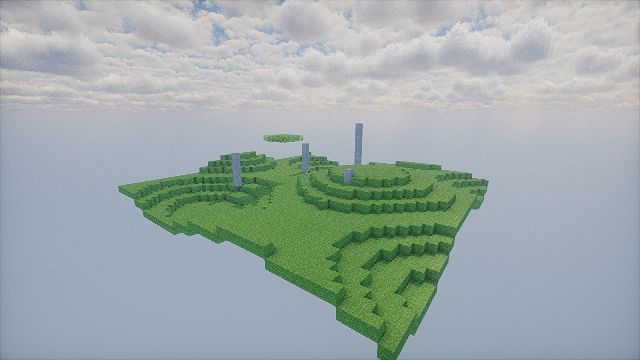
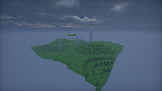
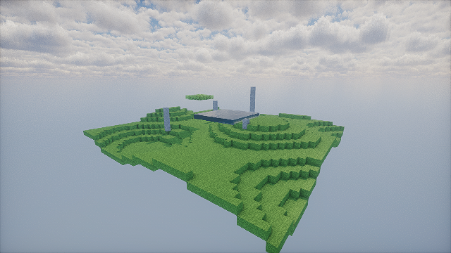

# Software validation evidence

These images execute the original external Photon pack at revision
`15458c0937f8647c37eb6a501bef5eb3bf3da31b`, with runtime commit
`f21d7938be2e03f7f5a6e3d16000520a6f85a295`. They use **generated block fixtures**,
not a live Minecraft world. The backend is desktop OpenGL compatibility on
Mesa 25.0.7 llvmpipe (LLVM 19.1.7), a software CPU renderer. They do not qualify
GTX 1650 Ti performance or full playable shader integration.

The day/water runs use 640×360; the other runs use 320×180. Every offscreen run
has eight warmup and 32 measured frames, selected original pack profiles and
an explicit `SH_SKYLIGHT=false` override. The optional atlas contains four vanilla
1.21.11 tiles extracted from the local official client JAR; no assets or pack
source are bundled here. Exact hashes and checks are in [manifest.json](manifest.json).

The images show generated grass terrain, stone pillars, a leaf canopy and an
optional raised pool. They confirm actual shader execution with recognizable
cloud/lighting changes. Remaining noise, the simplified sky/biome inputs, water
fixture geometry and missing actor/game inputs require reference validation.
No Iris comparison was performed.

Each matching JSON file contains the complete adapter limits/extensions, source
hash/options, frame inputs, ordered linked passes and raw per-pass GPU timer/CPU
submission timings. These measurements wait for queries each frame and exclude
presentation; treat them as software pass diagnostics. `deferred1` was the largest
mean measured GPU pass in these software runs. GPU bottlenecks on the laptop remain
unknown. Runs were sequential to avoid renderer-to-renderer contention.

The state-change run records time 6000→18000, rain 0→1, a 16-block camera teleport,
actual deletion of a fixture cube, darkened vertex light and changed material tint.
The orbit run exercises continuous camera reprojection. The high-profile run is a
separate original-profile check. [window.json](window.json) confirms 40 native
frames presented through an Xvfb window on the same software adapter.

Target qualification still needs the physical GTX 1650 Ti, original skylight
compute linking/execution, live-world integration, reference Iris images, release
frame intervals including presentation, cold/warm traversal and edit/time/weather/
resource-pack reload scenarios at 1080p with power/thermal conditions recorded.
