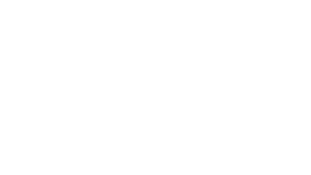
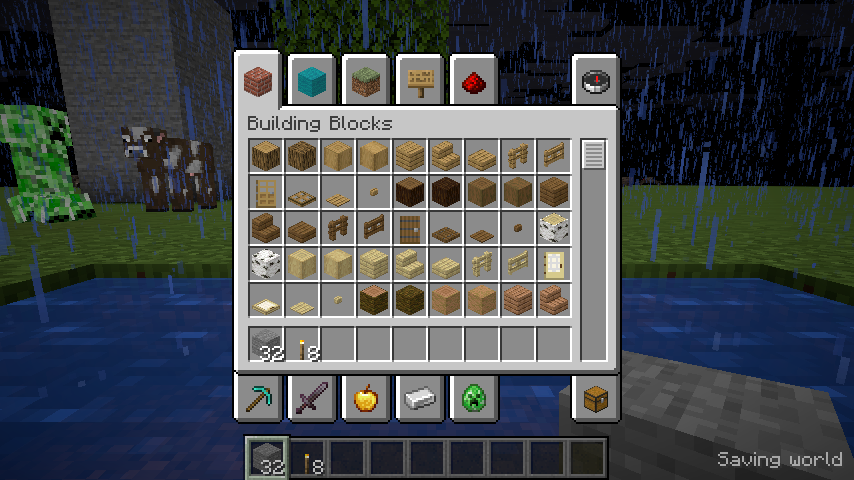

# Live native client validation

The primary integration target is Minecraft 26.3 / protocol 777. These runs use
an authorized vanilla server bound to localhost, seed 1650, creative mode, a
superflat overworld with one bedrock, 128 dirt and one grass layer, and view/
simulation distance 3. Official server/client JAR hashes and file checksums are
in [manifest.json](manifest.json). Assets and shader-pack sources remain external.
The OpenGL viewport is a compatibility/reference host; final game and pack
rendering are intended to use Vulkan in the same game window.

All images and timings below are from Debian 13, Xvfb and Mesa 25.0.7 llvmpipe
LLVM 19.1.7. They establish real pack execution and live-state plumbing. The
serialized viewport intervals exclude main-window rendering and do not qualify
hardware gameplay performance.



`26.3-day.json` records 160 presented frames at clean commit `f75b191`, actual
chunk meshes and the resource atlas, 81 loaded columns, a tracked entity, receipt
of 32 stone/eight torches and a server teleport reaching the camera. The test scene
contains a stone pillar, oak leaves, a water pool and a torch. The clock initially
advanced despite the server's frozen clock; that behavior failed and was repaired
in `7d876fe`. These initial images are historical rendering evidence.

`26.3-state.json` records 200 frames from `f75b191`, P switching between external
unmodified Photon revisions `15458c0937f8647c37eb6a501bef5eb3bf3da31b` and
`77d677fb5d484b4acc749386e9db99760a4397e0`, night/rain commands, torch removal,
glowstone placement, inventory opening and a spectator teleport underwater.
Both source hashes and history resets are recorded. Geometry revisions include
initial streaming and edits; their counts are not an isolated edit benchmark.



The cow, weather geometry and inventory are rendered by the existing Vulkan
renderer, not submitted to the GL pack graph. Inventory receipt is also recorded
in the live snapshots. This is a tested integration boundary, not full Photon
actor/UI parity.

`26.3-frozen-clock.json` records 80 release-client frames at clean `7d876fe`, all
with time exactly 6000 after the rate fix. The application exited normally when
the main window was closed after capture. `1.21.11-regression.json` records 40
release-client frames, protocol 774 translation, 81 loaded columns, and frozen
time exactly 6000 for the final ten frames after the freeze command. That
application also exited normally. The earlier 200-frame viewport completed,
but its main process was eventually stopped by the test timeout; bounded shader
capture intentionally leaves the game running.

For reproduction, build/run using the shader-pack README with the selected
version and local server. In the server console, force-load the scene before
editing it:

```text
forceload add -32 -32 32 32
gamerule minecraft:advance_time false
gamerule minecraft:advance_weather false
time set 6000
setworldspawn 8 66 12
fill -4 66 -8 -2 71 -6 minecraft:stone
fill 2 68 -8 5 70 -5 minecraft:oak_leaves[persistent=true]
fill 3 65 2 7 65 6 minecraft:water
setblock 1 66 0 minecraft:torch
summon minecraft:cow 0 66 -3 {NoAI:1b,PersistenceRequired:1b}
```

After the player joins, teleport to `8 66 12 180 15`, give stone/torches, then
exercise inventory, P switching, `time set 18000`, `weather rain`, torch removal,
glowstone placement and a spectator teleport to `5 64.2 4 180 10`. Include inputs
and the frame where each command arrives when comparing runs. The existing
26.3 configuration decoder reports one `registry_data` warning (`Expected
compound tag`); its registry/impact still needs isolation. No third-party server
or authenticated account was used. Physical GPU profiling and reference Iris
comparison remain separate acceptance checks.
