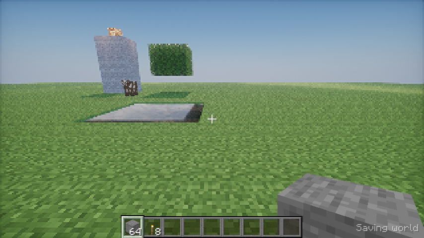

# Vulkan execution evidence

This first native game-window run uses the original external Photon revision
`15458c0937f8647c37eb6a501bef5eb3bf3da31b`, low profile, explicit
`SH_SKYLIGHT=false` and `SHADER_AO=0`. The 40 captured frames use the current
single-window Vulkan implementation before its first commit; the raw build
revision is correctly labeled `a6b6eb8+dirty`. This is preliminary evidence,
not a clean-release hardware benchmark or Iris parity claim.

The full window uses original Photon terrain, water, shadow/deferred/composite
passes, GPU color composition and shared depth, followed by existing native
forward entities, held items and UI. Those forward draws are not yet pack-shaded
or included in pack shadows/postprocessing.

`live-low.json` records 40 Vulkan pack frames on llvmpipe (LLVM 19.1.7), internal
320×179 and window 854×480, a local official vanilla 26.3 / protocol 777 server,
81 loaded columns, tracked entities, inventory and all world times exactly 6000.
The game window closed normally after screenshots. GPU timestamp intervals
exclude the native forward draws/UI/presentation and cannot qualify gameplay FPS.
The initial CPU timing fields are zero because that measurement was not yet
implemented; later code records actual command-record CPU time.

Validation reported no Vulkan errors in this completed run. Unused vertex-input
warnings were subsequently removed from the pack pipelines using SPIR-V
reflection. An earlier failed live upload resolved material predicates per vertex;
the palette-resolution fix enabled this completed run. An existing native item
push-constant stage-mask error found in that failed run was also repaired.
That historical run reported a registry compound-tag warning. The subsequent
protocol 777 adapter preserves scalar/list values under a tagged compound and
retains registry entry ordering; the live repair identifies the three new
`minecraft:block_transformer` values without that parse warning. Typed consumers
of those new payloads remain separate work.

The pack-only PNG excludes native forward draws and UI. All assets and pack
sources remain external. These software results do not measure the GTX 1650 Ti
or certify final quality/performance or distant terrain. Reproduction uses the
shader-pack README and the existing live validation world's scene commands.

## State and reference checks

`current/` contains a subsequent `b9ee1ba+dirty` validation run. Its live 240-frame
record shows actual server time 6000→18000, rain 0→1, changed geometry revisions,
and F6 reload in the native window. The internal extent is now 320×180 and respects
both configured resolution limits. CPU command-record intervals are measured in
this run; timestamp intervals still exclude forward actors/UI/presentation.

The controlled 28-frame state-change scenario records seven history invalidations
for initial state, time, rain, camera cut, actual geometry deletion, light changes
and material changes. Original Photon stage compilation passes `spirv-val` for
all 60 graphics modules, target Vulkan 1.2. Nether and End software fixtures also
execute (28 and 29 passes). These fixtures do not verify live dimension changes.

The paired textured 640×360 fixture images compare the Vulkan backend against
this project's GL host using matching inputs and 20 total frames. Mean absolute
RGB difference is 1.58/255; 96.1% of pixels have all channels within four levels.
This is a host comparison, not Iris parity. The packed-HDR Vulkan format fallback
and driver arithmetic differ; the maximum individual channel difference is 101.
The original Minecraft/Photon files remain external.

A separate 300-frame live reload record switches to the second original Photon
revision and reloads it with F6. `current/reload-events.txt` also records deliberate
unsupported QA-pack tests after that capture: failed loading/compilation retains
Photon, an active unbound sampler triggers controlled pack shutdown, and F7 returns
to Photon in the same window. No Vulkan validation errors occur across recovery.
The inventory screenshot was taken after returning to Photon; inventory graphics
remain native forward/UI draws. The injected QA source is not a Photon substitute.
